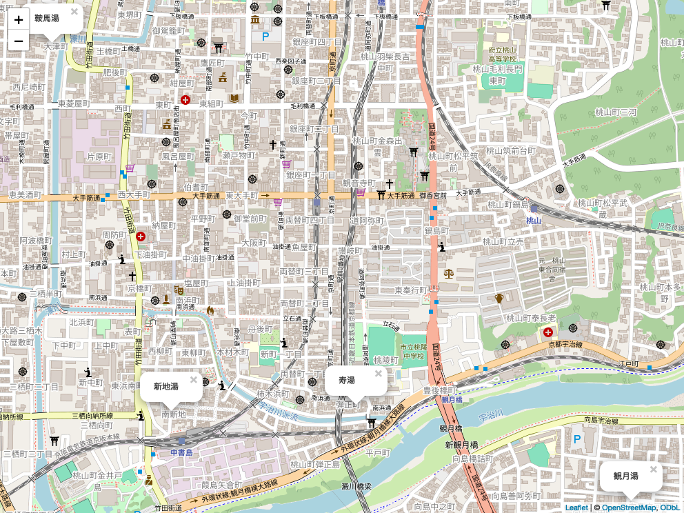
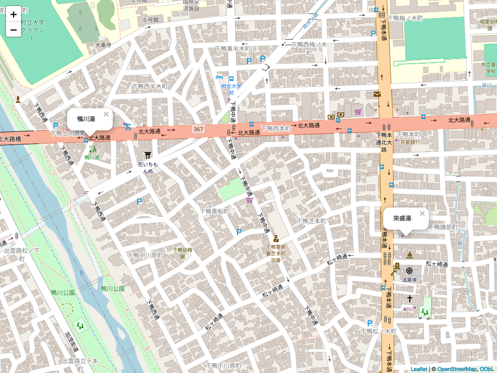

## はじめに

京都の一番の魅力は銭湯だ。そう思うようになったのには理由がある。私は二五歳の頃から累計で四年間京都に住んでいたが、行く先々で出会う銭湯が素晴らしいものばかりだったからだ。最初はただただ自宅の近くの銭湯に入りに行くだけだったが、京都の銭湯の魅力に取り憑かれた私は、京都各地の銭湯を巡るようになった。

銭湯なんて家のお風呂で十分、どこも同じだろうと思っていた私は、京都の銭湯の豊かな魅力に驚かされた。京都の銭湯は、それぞれが個性的で、その土地の特色を反映している。また、建物自体も美しく、なおかつその土地どちの文化や歴史を感じさせるものが多いのだ。例えば、第一章で紹介する「雲母（きらら）湯」という銭湯は、雲母坂という京都市内から比叡山へ向かう有名な坂の名前に由来している。

紫野にある門前温泉は、大徳寺の門前にあることからその名前がついた。大徳寺はそれ自体有名な観光地であるが、大徳寺だけでなく、その周辺の街並み全てが、大徳寺という空間の一部であるという感覚を持たせてくれる。伏見の銭湯は、天然の地下水を使った水風呂があるところが多いが、これは伏見が有名な酒蔵であることに由来している。酒造りに使われる水は、酒の味を左右する重要な要素であるため、酒蔵の周辺には美味しい水が湧いていることが多いのだ。

銭湯はいつの時代もその土地の文化や歴史を反映している。そのため、京都の銭湯を巡ることは、京都の文化や歴史を学ぶことにもなる。もちろん、そんな御託を並べるまでもなく、銭湯に入ることで体がリフレッシュされ、心が癒されることは間違いない。また、銭湯には地元の人々との交流の場としての側面もある。銭湯を垣間見ることによって、地元の人々の生活や考え方を知ることができる。

これまでの観光に銭湯という視点を加えることで、京都の新たな魅力を発見できること間違いなし。ただ寺社仏閣を巡るだけの観光に飽きた人、京都の文化や歴史に興味がある人、京都の暮らしを知りたい人、京都に住んでいる人、京都に住んでいた人、京都に行く予定の人、京都に行ったことのない人、全ての人におすすめしたい。

===

## 銭湯マップ

#1 一乗寺周辺

===

#2 伏見中書島周辺

===

#3 京都大学周辺

===

#4 元田中周辺

===

#5 下鴨周辺

===

#6 紫野周辺

===

#7 下京区周辺

===

## 一乗寺周辺の銭湯

### 鈴成湯

私は約二年間、左京区の一乗寺という場所に居住していた。家賃は三万円程度のワンルームで、共同シャワーとトイレが設備としてあるだけの物件だった。当時、私は京大の大学院生で金銭的な余裕があまり無かったので、安価な家賃と京大への近さを重視してこの部屋を選んだ。

共同シャワーは百円玉を投入すると五分間お湯が出る仕組みで、五分は短いと感じる人もいるかもしれない。しかし私にとっては十分であり、実際私は常に三分で上がっていたので、アパートの大家さんから「あんた烏の行水やなぁ」と言われたこともあった。

しかし、京都の冬は寒い。寒い日にはシャワーではなく湯船に浸かりたくなる。それらの時期に訪れていたのが、我が家から徒歩三分ほどの場所にある「鈴成湯」という銭湯だった。全体で5つの風呂があり、うち2つは泡風呂で、他に電気風呂と薬草風呂、最後に水風呂があった。

私の個人的なお気に入りは薬草風呂だった。その温度感がちょうど良く、そして大人一人が浸かるにはちょうど良いサイズなので、入ればほぼ貸切状態になる。温度はメインの風呂よりも低設定で、長時間浸かることができた。体を洗った後に、その薬草風呂に浸かると、体がポカポカ暖まり心地よい疲労感が溶けていく。

水風呂とサウナもまた、お気に入りの場所だった。ここの水風呂は半地下らしい構造で、メインの浴室から少し奥まって位置していた。そのため、周囲の喧騒から距離を置き、物理的にも精神的にもリラックスすることができた。昭和歌謡が流れるサウナから出てきた後に、水風呂に入ると、静寂が体を包み込んでくれた。

私はほぼ週に4〜5回の頻度で訪れていたので、毎回料金を払うのが面倒で回数券を使っていた。番頭のおばあさんとも顔見知りになり、特に会話をすることは無かったが、顔を合わせると互いに笑顔で挨拶を交わす仲だった。

引越し前日、これが最後の訪問になるだろうと思い、通常通りに回数券を渡さず現金で支払ったら、番頭さんに訝しそうな視線を向けられたのは今でも鮮明に覚えている。私が一貫して回数券を利用していたので、それを使わないこと自体が新鮮だったのかもしれない。

その時が最後の鈴成湯訪問となったが、今でもその銭湯を思い出すと懐かしさと少しの寂しさが感じられる。当時、部屋にお風呂が無いことは不便だと感じていたが、今ではその生活が本当の贅沢だったと思っている。

### 大黒湯

京都には大黒湯という名前の銭湯が複数存在するが、ここで紹介するのは叡電の修学院駅から近い左京区にある大黒湯だ。修学院という名は、その名の通り近くに位置する修学院離宮から名付けられたもので、修学院から約20分歩くと修学院離宮までたどり着ける。修学院離宮は京都の中でも特別に広い庭園を保有しており、特に紅葉の季節には多くの観光客で賑わう。私自身は一度も行ったことがないが、京都観光では一度は訪れてみる価値があるだろう。

修学院自体については特に思い出はないが、一乗寺から修学院までは一駅しかなく、その距離もせいぜい600メートル程度だった。そのため、鈴成湯が定休日の際にはこちらの大黒湯に足を運んでいた。大黒湯の最大の特徴は何と言ってもサウナで、銭湯ながら2種類のサウナを備えている。

一つ目は通常のドライサウナ、もう一つはミストサウナだ。ドライサウナは5～6人が入れる広さを持ち、テレビも設置されておりかなり豪華だ。ミストサウナは大人2人分程度のこじんまりとしたサイズであるが、その分落ち着いて利用することができる。私自身はどちらかと言えばミストサウナを好み、時間をかけて体をゆっくりと温めていた。ミストサウナは他の場所よりも低い温度に設定されていることが多く、水風呂に入った際に冷えすぎてしまうこともあったが、ここのミストサウナでは十分な温度が確保されているため、安心して水風呂に移動できた。

また、大黒湯の見所はサウナから水風呂への動線が完璧に整備されている点だ。水風呂は一つしかないが、どちらのサウナからでもすぐに水風呂に行くことができる。さらに、水風呂の広さは十分で最大で4人ほどが同時に使用できる大きさだった。

水風呂から出た後はそのまま椅子に座って体を冷やすも良し、隣にある薬草風呂で体を温めるも良し。とにかくこちらに来ればほとんどの疲れが一気に吹き飛ぶ感じがあり、私が大黒湯に通っていた間、風邪を引くことはほぼ無かった。それもこの理由があるのかもしれない。

大黒湯の隣には一部で有名な高級焼肉店があると聞く。私は一度も訪れることはなかったが、食べログのレビューによると人生が変わるほど美味しいと評判だ。経済的な余裕がある方は、是非ともその焼肉店にも足を運んでみて欲しい。

### 雲母湯

修学院から比叡山へ向かう道は「雲母坂」と呼ばれている。読み方は「きららざか」で、一見するとなかなか読めないかもしれない。名前の由来は複数説あるが、この地域に多くの雲母が含まれる土砂があることや、京都市街から見える景色がまるで雲が湧き出るように映ることからとされているが、正確な由来は明らかではない。

この雲母坂を途中で訪れると、「雲母湯」という銭湯がある。私自身、友人と比叡山に登った帰りに、この銭湯で体を癒した経験がある。比叡山は大人ならば約2～3時間で登ることが可能だが、登り下りを合わせるとそれなりに疲れる。そのため、登山の後にこの銭湯を訪れると、とても気持ちが良いものだ。

ただし、この雲母湯はやや因縁深い場所でもあり、「雲母湯 事件」で検索すると、かつてのニュース記事が出てくるほどだ。記事によれば、雲母湯を出るとすぐのところで暴力団の組員が別の組員に襲撃された事件があったという。確かにこの銭湯には、その筋の人々がちらほらと見受けられ、私が訪れた時も、子分と思しき若者が親分の背中を流すといった光景を目にした。

それだけ述べると、何やら不穏な印象を与えてしまうかもしれないが、実際に危険な状況に遭遇したことは一度もなく、大半の客は普通の人々なので、安心して利用可能だ。

雲母湯の魅力は比叡山の麓という素晴らしい立地であり、そして何と言っても広々としたサウナがあることだ。銭湯のサウナは一般的に狭いことが多いが、ここでは清潔感あふれる広々としたサウナを楽しむことができる。深さも十分な水風呂もあり、非常に気持ち良い。また、やや高めの温度設定のジャグジーもあり、疲れを癒すのに最適だ。

メインの浴槽しいるイルカの銅像も名物で、歴史の深さを感じさせる建物ながら洋風でモダンな印象を与えてくれる。雲母湯は一度、前オーナーの病気により閉店の危機に近づいたが、現在は有志によって運営され、何とか存続している。

一乗寺に住んでいた頃は近くに銭湯があるにも関わらず、自転車で特別にこの雲母湯に行くことがよくあった。日常生活にちょっとした刺激を加えたいときや、比叡山に登った帰りに疲れを癒したいときなどには、この雲母湯は最適だ。

===

## 伏見中書島周辺の銭湯

### 新地湯

伏見区は京都駅の南側に位置する区で、伏見稲荷神社や伏見桃山城など、観光地で有名な場所がある。ただし、京都観光のメッカである清水寺や金閣寺は京都駅の北側に位置するため、伏見区を訪れる観光客は比較的少ないのではないかと思う。

私は2021年から半年ほど伏見区に住んでいた。住んでいた場所は京阪の中書島駅の近く、葭島矢倉町といい、伏見十石船や月桂冠大倉記念館がある地域で、古い街並みが色濃く残っていた。

銭湯好きの私は、引っ越した先でも頻繁に銭湯を訪れていた。その中でも最初に訪れたのが新地湯である。この銭湯は中書島駅から非常に近く、主要駅からこれほど近い銭湯も珍しい。外観はレトロで、営業時間外に訪れると銭湯だと気づかない人もいるかもしれない。一見洋風の見た目は、京都の銭湯としては珍しい。

新地湯の魅力は、アクセスの良さに加え、比較的いつ訪れても空いている点である。駅に近いとはいえ、周辺に学校や工場があるわけではないため、客層は地元の人が中心で、観光客の訪問はほとんどない。小さながらもスチームサウナと水風呂が完備されており、湯船で体を温めた後にサウナと水風呂に入るのが日課だった。

日本酒で有名な伏見のため、新地湯の水風呂は伏見の地下水をそのまま使用している。京都の銭湯で地下水を用いた水風呂が珍しくない中でも、伏見の水風呂は別格である。入った瞬間に感じる水のなめらかな感触とキリッとした澄んだ感じが、伏見という土地の特徴を感じさせる。本来は日本酒の醸造に使われる水なのだから、これは当然である。

伏見区、とりわけ中書島周辺は、昔日本でも有数の遊郭があったと聞く。今はその面影はないが、新地湯のレトロな外観は、かつての時代の雰囲気を感じさせる。風呂に入りながら、過去の伏見の面影を想像するのもまた一興である。

### 寿湯

二軒目に紹介する銭湯は寿湯である。大黒湯と並んで、全国に同名の銭湯が無数にあるような名前であるが、場所は伏見区の弾正町にある。

先ほどの新地湯と比べると、アクセスという観点から見るとかなり行きづらい場所にある。中書島駅からも不可能ではないが、最寄り駅は観月橋という京阪の中でもかなりローカルな路線の駅で、そこから徒歩で約5分かかる。周辺は閑静な住宅街で、特に用事がなければあまり足を運ぶことはないだろう。

一方で客入りという観点では、新地湯よりもむしろ混んでいることが多い印象である。学生や若い人は少なかったが、地元の人がよく来ており、特に夜になるとかなり混んでいた。この辺りは完全に住宅街なので、昔からこの地域に住んでいる人が多いのだろう。アクセスがあまり良くないため駐輪場が充実しており、店の奥にはいつもかなりの数の自転車が並んでいた。

広さについては、こちらは新地湯よりも狭い。しかし、小さいながらもドライサウナのほかにスチームサウナも備えており、二つのサウナを楽しむことができる。また、水風呂も伏見の名水を使用した贅沢なもので、新地湯に劣らず優れた水質を誇っている。

寿湯の近くには京都では有名なビデオ１というレンタルビデオ店がある。今時レンタルビデオが流行らないと思いつつも、百円そこそこで借りられるため、寿湯に行った際にはよく利用していた。サブスク全盛の今だからこそ、実際に店舗に行って、膨大な棚の中から「これは」と感じる一本を探すのが楽しいのである。

寿湯は、新地湯とは異なる趣がある銭湯である。アクセスが悪いため、京都に住んでいる人でさえもなかなか行くことがないかもしれないが、一度訪れる価値はあると思う。

### 観月湯

伏見区シリーズ三件目の銭湯は、先ほどの寿湯から宇治川を渡り、近鉄の向島方面に少し行ったところにある観月湯である。先の寿湯もアクセスが悪いと述べたが、こちらはそれ以上に行きづらいかもしれない。住宅街の中に位置しており、寿湯とは異なり、かなり明るい雰囲気がある。

観月湯の名前の由来は、近くに位置する観月橋という有名な橋からきていると思われる。これは宇治川にかかる橋であり、その名の通り、月が美しく見えることで有名である。観月湯はその観月橋の近くにあるため、その名がつけられたのだろう。現在は街の明かりがあるため、昔ほど月が美しく見えるとは思えないが、宇治川と月の組み合わせが美しいことは間違いないだろう。

最初に訪れた際に驚いたのは、町の銭湯に似合わないその広大な敷地である。入口は普通の銭湯のそれであるが、中にはアミューズメントパークのように様々な風呂が備えられている。ジェット風呂、薬草風呂、電気風呂、深風呂、浅風呂、サウナ、水風呂という、これ以上ないほどのラインナップがあり、どれも十分な広さを持っている。

特に注目すべきは、まるでプールのような絶妙な温度の水風呂である。サウナ後はもちろん、普通のお風呂に入った後に少しクールダウンしたいときなどにもぴったりである。銭湯でありながら、子連れの客も比較的多いことから、これだけの設備があれば子供も楽しめるだろうと思う。どの風呂に入ろうか迷っているうちに、自分がスーパー銭湯に来たかのような錯覚に陥ることがある。

後で調べた情報によると、観月湯は日曜日に朝風呂を行っており、朝9時から利用できるそうだ。京都で朝風呂を提供している銭湯は多くないため、朝風呂を楽しみたい人にはおすすめである。場所が場所だけに、観光客として訪れるのは難しいかもしれないが、朝から銭湯に入り、その後に伏見観光をするのも、上級者向けの楽しみ方であるかもしれない。

### 鞍馬湯

伏見シリーズ最後の銭湯は、鞍馬湯である。これまで紹介した3つの銭湯がすべて中書島駅付近に位置していたのに対し、この鞍馬湯は伏見区の中でも近鉄の丹波橋駅付近にある。ただし、「付近」と言っても、歩くには少々遠い距離に位置している。方向性としては、丹波橋駅から有名な伏見大手筋商店街の方面に向かい、途中に位置する銭湯である。

伏見大手筋商店街を知らない人への説明は、「大手筋」とはかつて秀吉が伏見城を建設した際に、大手門から伸びる道に「大手筋通」と名付けたことが起源である。商店街として整備されたのは明治時代からで、その歴史のある商店街が今でも伏見の中心的な場所として日常的に利用されているのは、その長い歴史を物語っている。

鞍馬湯は、その大手筋商店街を抜け、湊川を渡った場所にある。この周辺は完全な住宅街で、商店街の賑やかさとは対照的に静かな雰囲気が漂っている。同じ伏見区内でも、中書島の方は比較的古い住宅が多く見られるが、丹波橋付近は比較的新しい建物が多い印象がある。そのような中で、鞍馬湯はモダンな雰囲気を醸し出している。

内装は小さくも清潔感があり、浴槽の種類には定番の深風呂や浅風呂だけでなく、生姜湯やエステ風呂といった、老舗の銭湯では珍しいような種類もある。エステ風呂の正式名称は「ハイパワースーパーソニックジェットバス」といい、通常のジェットバスと比べて泡が細かく、柔らかい肌触りが特徴である。実際に使ってみると、特に印象深いわけではなかったものの、確かに泡が細かく柔らかいと感じた。

また、併設されているサウナは、「スチームドライサウナ」と称されており、ミストサウナとドライサウナの中間に位置する。湿度がやや高めのドライサウナで、熱を足元からも加える設計になっているため、短時間で全身を均等に温めることができ、身体にも優しいとされている。

水風呂は京都伏見の天然水を使用しており、温度は冷たいものの、肌に触れる感触は柔らかい。これは京都伏見の天然水の特徴であり、この柔らかさは水道水では得られない独特の味である。

銭湯を出た後、まだ日が明るかったので自動販売機で飲み物を買って帰路についた。銭湯の後に飲むスポーツドリンクの美味しさに改めて気づき、たまには新しめの銭湯に行くのも悪くないと感じた。

===

## 京大周辺の銭湯

### 東山湯

私が京都に引っ越したきっかけは、京都大学の大学院に進学するためであった。京都大学は市内に3つのキャンパスを持っており、私が通っていたのは左京区にある吉田キャンパスである。ちなみに、他の2つのキャンパスは宇治キャンパスと桂キャンパスである。

吉田キャンパスといえば、兼好法師ゆかりの吉田神社が有名で、この神社はキャンパスからすぐ近くに位置している。学業に疲れたとき、特に目的もなく吉田山へ登り、そこからの眺望を楽しんだことがある。これは手軽に登れる小高い山であり、ここからは京都市の街並みを一望できる非常に心地よい場所である。

ただし、京大名物としては吉田神社よりも、百万遍の立て看板や吉田寮の方が有名かもしれない。百万遍の立て看板は京大生によって製作され、名前の通り百万遍の交差点に設置されている。数は一時期に比べて減ってはいるが、今でも百万遍周辺には多数の立て看板が設置されている。

百万遍の近くには、浄土宗の有名な寺院である知恩寺がある。これが地名「百万遍」の由来である。その百万遍の交差点から約50メートル離れた場所に、京都大学に最も近い東山湯という銭湯がある。

この銭湯は小規模ながらも、薬風呂やジェットバス、サウナ、水風呂といった設備が一通り揃っており、学生に人気がある。小規模なため、多人数で賑やかにするよりも、一人や親しい友人同士で静かに入ることが多い。個人的には、この銭湯の薬風呂が非常に気に入っており、温度も適切で、薬草の香りが心地好い。

この銭湯の特徴の一つは、ビートルズを推していることである。脱衣所など至る所にビートルズのグッズやイラストが飾られている。銭湯の近くには「リンゴ」というビートルズファンにとっての聖地となるバーもあり、恐らくそのバーとの関連があるのだろう。ビートルズファンであれば、ぜひこの銭湯を訪れてほしいと思う。

伝え聞くところによると、京大には銭湯サークルが存在し、営業終了後にメンバーが清掃を担当しているという。私自身は銭湯サークルに参加した経験がないため、その活動の詳細は不明であるが、市内外の銭湯を巡ると聞いている。ただの利用者としてだけでなく、銭湯の清掃を行うというのは、銭湯に対する深い愛情が感じられ、尊敬に値する。

現在は風呂付きの部屋に住む学生が増えているため、銭湯を利用する学生も減少しているかもしれない。しかし、京大に通う学生であれば、一度は訪れる価値のある銭湯である。

### 銀座湯

京都大学の吉田キャンパスは、大きく3つに分かれており、農学部のある北部キャンパス、時計台で有名な本部キャンパス、そして吉田寮のある南キャンパスがある。本部キャンパスを中心に、それぞれ南北に一つずつ位置している。私が所属していた研究室は南キャンパスに位置していた。

南キャンパスの近くには、京都のお土産として有名な聖護院八ツ橋の本店や、京都大学のもう一つの寮である熊野寮など、百万遍とはまた異なる雰囲気を持つエリアがある。聖護院八ツ橋の向かいには、ライバル会社である西尾八ツ橋の支店があり、東大路通を挟んでにらみ合っているかのような配置である。両社は共に元祖を謳っており、一部では訴訟に発展していると聞いているが、私には詳細はわからない。

さて、そんな南キャンパスから最も近い場所に、最近リニューアルオープンした銀座湯がある。リニューアルしたのは2020年の1月で、私が京都に引っ越してきた2019年にはまだ利用できなかった。先代のオーナーが亡くなられたことでしばらく休業していたようだが、その孫が跡を継ぎ、リニューアルオープンした。

銀座湯は大通りからかなり奥まったところにあり、地図を見ずにたどり着くのは非常に困難である。南キャンパスの南側には近衛中学校があるが、その真裏に位置するため、目印としては最適である。

キャンパスから非常に近いため、今回は研究室の後輩を誘い、夕方4時ごろに訪れることにした。入ってみて驚いたのは、平日の夕方にも関わらずかなりの人が利用していたことである。場所が場所だけに、知る人ぞ知る秘湯というイメージがあったが、そうでもなかった。

重要な浴槽は、深風呂、ジェット風呂、薬湯、電気風呂、サウナ、水風呂を含む充実したラインナップである。リニューアルオープンしたばかりで内装も美しい。浴槽の配置は、中央に大きな浴槽があり、その周りに小さな浴槽が並ぶ構成である。お湯の温度がやや高めなので、長時間浸かることはできない。

今回一緒に行った後輩がサウナ好きだったため、風呂の後はもちろんサウナを楽しんだ。適度な温度設定により、熱すぎずゆっくりと汗をかくことができた。非常に心地よかったため、平日の夕方にもかかわらず、のんびりと約2時間過ごした。

今回私は、研究の合間にサウナに入ることで頭がリフレッシュし、研究の効率が上がるかどうかという仮説を検証しようとしていた。サウナを出た後、すぐにそのまま研究室に戻り、論文の執筆を続けた。しかし、結果としては効果が全くなく、身体が温まったことでかえって眠くなってしまった。その日は早々に研究を切り上げ、帰宅したのである。

### 平安湯

南キャンパスから岡崎公園への近さは魅力的だ。岡崎公園周辺には平安神宮をはじめ、美術館や博物館などが点在し、数多くの観光スポットが集まっており、何度行っても飽きない場所である。

南キャンパスから岡崎方面へ向かうルートはいくつかあるが、その一つである吉田東通という小道には、京大生をターゲットにした定食屋が多く並んでいる。私のお気に入りは末広食堂とキャラバンで、学生時代に数えきれないほどお世話になった。どちらも手頃な価格でボリューム満点の定食が楽しめるため、学生には特におすすめのお店である。

そんな吉田東通に面して存在感を放つのが、地元の人々や学生で常に賑わっている平安湯である。15時の開店と同時に常連客が続々と訪れるため、平日でもすぐに混雑する。それだけではなく、施設自体のサイズも比較的小さめなことが、その賑わいを加速させているように感じる。

平安湯の特徴は健康をテーマにした浴槽の存在だ。トルネードエステバス、足つぼ健康風呂、超音波泡風呂など、他の銭湯ではまれにしか見られない種類の風呂も設置している。もちろん、通常の浴槽も完備されており、健康志向でない人でも十分に楽しむことができる。

私自身も何度か平安湯を利用しているが、実は少し苦い経験がある。ある日、いつも通り番頭さんに料金を渡して脱衣所に入ろうとしたところ、間違えて女湯に踏み込みそうになったのだ。幸いにも間一髪で常連客に声をかけられ、大問題には発展しなかったが、後の出来事が思い出深い。女湯に間違えて入ろうとした客が珍しかったのか、常連客同士の会話で「今日間違えて女湯に入ろうとした人がいたんだよー」と大声で語られてしまった。もしかすると彼らの間では話題がなかったのかもしれないが、本人のいる前でそんな会話をするべきではないと私は感じた。

また別の日には、サウナに入った後の休息中に常連客から「大丈夫か？」と心配されたこともある。地元の人々はサウナや水風呂の後に椅子で休む習慣がないらしく、私が椅子に座っていたので体調が悪いと思われたのだろう。私は大丈夫であると返答したが、その日は少し落ち着かない気持ちになった。

平安湯は、京大生に健康に関する知識を深める場所として、また地元の人々と交流する場として一役買っている。先に述べたエピソードも今となっては良い思い出だ。健康に関する知識を深め、地元の人々との交流を経験することができるこの銭湯を、ぜひ一度訪れてみてほしい。

===

## 元田中周辺の銭湯

### しののめ湯

百万遍から東大路通を北に数百メートル行ったところに元田中という地名がある。なんとも味のある地名であるが、かつてこの地は「田中の里」と呼ばれており、それが転じて「元田中」となったという。元田中のすぐ近くには「田中神社」という神社があり、これが日本人の名前にもよくある「田中」という名前の由来になったと言われている。

現在、元田中周辺は京都で知られた小さな中華街となっている。京都大学には中国人の留学生が多いため、彼ら彼女らのニーズに応える形で、中華料理店が多く出店している。そのため、提供される料理は本格的であり、「ガチ中華」と呼ばれるジャンルに属するだろう。日本人向けの中華料理店とは一線を画すものが多い。

そんな元田中にある銭湯が「しののめ湯」だ。東大路通沿いに位置しているため、京都大学の学生には有名な銭湯であり、近くの焼肉屋とセットで利用する学生も多い。浴槽のラインナップとしては、ジェット風呂、泡風呂、サウナ、水風呂などがあり、客層としては学生だけでなく、子供連れも多いため、いつも賑わっている記没がある。

これまで紹介した京都大学周辺の銭湯は、広さでいえば比較的小さいものが多かったが、しののめ湯は比較的広い。浴槽の数も多く、浴槽の種類も豊富なので、ゆっくりとくつろぐことができる。個人的な話で恐縮だが、この銭湯で電気風呂の楽しさを知った。

電気風呂は、入った瞬間にびりっとする間隔があるため、苦手な人も多いと思う。しかしこの銭湯の電気風呂は出力が絶妙で、びりっとする間隔が長く、強すぎないため、電気風呂が苦手な人でも楽しめる。一度入ると、凝り固まった筋肉がほぐれる感じがし、とても気持ちが良い。人の手でマッサージされるのとは、また違った感覚で、一日の疲れを癒すことができる。

また、サウナの横にある冷水の打たせ水もここの名物である。高さ二メートルほどのところから冷水が滝のように落ちているため、サウナで汗をかいた後に浴びるととても気持ちが良い。熊本にある「湯ラックス」という西の聖地と呼ばれるサウナがあるが、個人的にはその冷水シャワーに匹敵すると思う。

しののめ湯に入った後は、近くのスーパーでアイスを買って帰るのが日課であった。スーパーのアイスは安くて美味しく、銭湯の後に食べると格別である。銭湯の後にアイスを食べることは、銭湯を楽しむ方法の一つだと思う。

### 養正浴場

京都の銭湯としては珍しく「浴場」という表現を用いているが、その訳はこちらの銭湯が京都市内にある数少ない市営の公衆浴場だからである。場所は京阪の出町柳駅から北へ約五分ほど歩いたところにあり、近隣には大規模な市営住宅も存在する。京都には銭湯が多数あるが、市営の銭湯は7つしかなく、左京区内でこの養正浴場と鹿ヶ谷にある錦林浴場の二つだけである。

料金は490円と市営であるからと言って特別に安いわけではないのが残念な点だが、設備やサービスには市営銭湯ならではの特徴がある。具体的には、バリアフリーが徹底されており、水風呂やお湯の設定温度がマイルドに調整されている。このような配慮のおかげで子供から高齢者まで誰でも入りやすい作りとなっており、誰にでも優しい設計だと言える。

浴槽の構成はシンプルで、メインの深風呂に、ぬるめの水風呂、そして広めの電気風呂がひとつだけある。京都市内の銭湯としては珍しく、サウナがないが、そのためか比較的ゆったりと入ることが可能であり、元田中に住んでいた時は頻繁に利用していた。

特に、ここの電気風呂は、私が電気風呂に入れるようになった理由であると言っても過言ではない。ここの電気風呂の刺激は非常にマイルドで、初心者でも安心して入れるようになっている。元々電気風呂が苦手だった私も、ここの電気風呂を利用して徐々に刺激に慣れることで、電気風呂の魅力に気が付くことができた。

また、ぬるめの水風呂もサウナがない状況ではかえって心地よく、深風呂で温まった身体をマイルドに冷やしてくれるので、交互浴を繰り返せば疲労を効果的に解消できる。

昔、東京からの友人が京都を訪れた際には、この養正浴場に連れて行った。関東にはなかなかないタイプの銭湯なので、東京の友人にとっても新鮮な体験となり、喜んでくれた。鹿ヶ谷にあるもう一つの銭湯にも行ってみたかったが、結局行かないままでいるのは残念である。

===

## 下鴨周辺の銭湯

### 栄盛湯

下鴨神社から北に少し行ったところに位置する栄盛湯は、京都市内においてかなり隠れ家的な存在である。昔、元田中に住んでいた際は、よくこの銭湯を利用していた。

下鴨神社は、京阪の出町柳駅から10分ほど歩いた場所にある世界遺産で、元田中に住んでいた時期には、散歩がてら夜に参拝するのが日課だった。普通の住宅街に世界遺産があるのは、京都ならではの風景であろう。

さて、地理的に見てこの銭湯はかなりわかりづらい場所にある。一応、目の前の通りには松ヶ崎通という名前が付けられているが、それは決して大きな道ではなく、どこから始まりどこで終わるのかも明確ではない。

初めてこの銭湯を訪れた際は夜だったため、スマートフォンを頼りに何とかたどり着いた記憶がある。

銭湯の隣には「千成食堂」という定食屋があり、やけに様々な場所で見かけることに気づいたが、どうやら京都市内で展開しているフランチャイズ形式のチェーン店のようであった。しかしながら、京都市外では見たことがないため、ある意味で京都の特色ある名物と言えるかもしれない。私の記憶によると、味は比較的普通であった。

栄盛湯の所在地がわかりにくいもう一つの理由として、銭湯の外観が古民家風である点が挙げられる。通りがかる人が「ゆ」という看板を見逃こがすと、普通の住宅と思って素通りしてしまいそうである。玄関には錦鯉のいる日本式の庭園もあり、通常の銭湯とは異なる雰囲気を持っている。

中に入ると、外観からも予想される通り、味わい深い内装が迎えてくれる。大正時代に開業して以来、その当時の内装を今に伝える。京都市内を探しても、これだけ古い銭湯はなかなか見つからないだろう。

栄盛湯の最大の特徴は、何と言ってもガラス張りのサウナである。サウナ内にはガラス張りの窓が設置されており、脱衣所からサウナ内部が丸見えになっている。脱衣所にはテレビがあるため、サウナにテレビはないが、サウナ内でテレビを視聴できるのは他では味わえない開放感である。

やや小ぶりだが、サウナの横に併設されている水風呂も魅力的である。京都市内の定番である地下水を汲み上げる方式で、非常に水質の良い水風呂を楽しむことができる。

他の浴槽も小ぶりで、隠れ家的な銭湯だけに客数も少なく、ちょうど良い規模感である。賑わいのある銭湯もその魅力はあるものの、時には一人でゆっくりと浸かりたい時もある。そうした時には、この銭湯が推奨される。

### 鴨川湯

鴨川湯はその名の通り、賀茂川のほとりに位置する銭湯である。場所としては北大路通と賀茂川が交わるあたりに位置している。大正15年に創業した老舗の銭湯であり、一時期は後継者不足で存続が危ぶまれることもあった。現在は「ゆとなみ社」という会社が経営を引き継ぎ、さまざまなイベントを開催しているそうである。私が訪れたのはゆとなみ社が経営を引き継ぐ以前のことで、現在とは少し実情が異なるかもしれないが、その点はご容赦いただきたい。

ところで、鴨川と賀茂川の違いについて、今更ながら疑問に思った。調べてみると、高野川が合流する以前の本流は賀茂川、合流後の本流は鴨川と呼ばれているという。上流にある上賀茂神社は「賀茂」表記であるのに対し、下流の下鴨神社は「鴨」表記である。高野川と賀茂川が合流するのは、かの有名な出町柳のデルタと呼ばれるポイントで、ここから下流が鴨川となる。台風などの大雨の際には、デルタが見えなくなるほどまで水位が上がり、治水のために堤防が築かれている。

さて、鴨川湯の特徴についてであるが、実はこれと言って印象に残る点は少ない。お風呂のラインナップには浅風呂、深風呂、ジェット風呂、サウナなどの定番があり、店内は比較的こじんまりとしている。近くに京都府立大学があるため、夜には学生が多いという話を聞くが、私が訪れたのは昼間であったため、それほど混雑しているわけではなかった。

唯一印象に残っているのはその外観で、老舗の銭湯だけあって外観はかなり古い。最初はこの銭湯が営業中なのか疑問に思うほどであったが、中に入ると意外と清潔で、お風呂も快適であった。北大路駅や北山駅からのアクセスも良いため、観光のついでに立ち寄ってみるのも良いかもしれない。

===

## 紫野の銭湯

### むらさき湯

北大路は京都市の北区に位置し、北大路通という主要道路がこの地域を貫いている。地下鉄北大路駅の近くには、当時ビブレという名の大型ショッピングモールがあり、学生時代には買い物でよく利用していた。

約10分ほど歩くと北大路駅からむらさき湯に到着する。この近隣には青少年活動センターがあり、当時私が20代後半であったにもかかわらず、市の区分によれば30歳未満は青少年に含まれるため、ウクレレサークルの練習などで頻繁に使用していた。

むらさき湯に最初に足を運んだのは、青少年活動センターでウクレレの練習をした後のことである。ウクレレサークルの部長であるKさんと、練習の疲れを癒すために銭湯を訪れることにした。

京都市内でも有数の露天風呂を擁するむらさき湯の特徴は、そのこぢんまりとした露天風呂にある。この露天風呂は大変小さく、人が3人入ればいっぱいになるくらいの大きさである。

しかし、露天風呂の有無は大きな違いを生み、特にサウナ後の外気浴の可否に影響する。サウナの後に外気に触れることで体を冷やすことができ、これによりサウナの効果を高めることができる。

露天風呂のおかげでKさんもサウナに夢中になったと言っていた。これほど、露天風呂はサウナにとって重要な要素である。

また、むらさき湯が公式ウェブサイトを持っていることを後から知った。銭湯が公式ウェブサイトを持つことは珍しく、それが店主のこだわりを示していると言っても過言ではないであろう。

ウェブサイトには独特なフォントが使われており、正直なところ普通のフォントの方が見やすいが、これも銭湯の雰囲気を反映しているのだろう。

車での訪問者には駐車場も完備されており、おすすめである。

### 門前温泉

先に紹介したむらさき湯の近くで、堀川北大路という交差点から少し北に位置するのが門前温泉である。

門前とは、寺社の門の前という意味で、この温泉がある場所がある有名な寺社の門前であることからこの名が付いた。

その有名な寺社とは、臨済宗の大本山である大徳寺である。大徳寺は鎌倉時代末期に創建され、応仁の乱で焼失したが、後に著名な一休和尚により再建された。一休和尚は禅問答で知られているが、ここは臨済宗であるため、禅宗の中心地とも言える。境内は非常に広く、半日を費やしても見尽くせないほどである。禅宗の寺院らしい控えめな装飽はないが、静かな雰囲気が漂い、個人的には京都の中でも非常に好きな寺院だ。

門前温泉に話を戻すと、この場所の魅力は、小さながらも力強いサウナと露天風呂にある。水風呂とサウナ、露天風呂への移動がコンパクトな流れでできる点は、サウナ好きにとって非常に魅力的だ。ここに訪れる前に大徳寺を観光し、その後サウナでゆっくりとした時間を過ごすのは、何物にも代えがたい贅沢である。禅僧からの教えを受けた直後にサウナで心が落ち着いたとき、ふと禅問答を思索するのも楽しい瞬間だ。

そんな大徳寺の周辺には門前温泉の他にも紫野温泉、金龍湯という3つの銭湯があり、これら3つを「大徳寺三銭湯」と私は呼んでいる。金龍湯の「金龍」は、故あって名前が金龍院であった大徳寺の塔頭にちなんでいる。銭湯の名前からも歴史を感じることができる点は、京都の銭湯の大きな魅力である。

### 船岡温泉

ここの銭湯は北大路通りよりもむしろ、それを少し南に行ったところの鞍馬口通りに面しており、果たしてここをどのカテゴリーに分類するかは微妙なところである。しかし、京都の銭湯の中でも特に有名なため、紹介しないわけにはいかない。

この辺りの街並みは「レトロ」と一言で表現でき、京都の中でも特に昭和初期の雰囲気が残っているところだ。昔ながらの電気屋や古民家風のカフェも点在し、レトロな雰囲気を味わいたい人にはおすすめの場所である。

そんな中にあって船岡温泉もまた、老舗の銭湯の雰囲気を漂わせ、その威厳は感じるレベルである。門構えが非常に立派で、この種類の門を一般に唐門という。平安京が唐の都である長安を模して作られたため、京都には唐門が多いが、ここの唐門は特に立派である。

そして、船岡温泉の近くには清少納言が『枕草子』で「丘は船岡」と詠んだ船岡山がある。私も船岡温泉に行く前に実際に船岡山に登ってみたが、京都を代表する丘という感じで、京都の街並みを一望できた。山というよりは丘という感じで、登りやすいので、京都に来たらぜひ登ってみることをおすすめする。

館内に入るとまず、圧倒的なレトロさを漂わせる脱衣所に驚かされる。銭湯の脱衣所で印象に残る場所は少ないが、ここの脱衣所はそれ自体が文化遺産のような威厳を漂わせ、まさに生活に調和した芸術だ。一番の見どころは天井にある天狗と牛若丸の彫刻で、天井にそういった彫刻があること自体が珍しいため、非常に興味深い。

浴室に入ると、その広さにも驚かされる。入り口は二重扉になっており、浴室の温度が外に漏れないように配慮されている。浴槽の種類もジェットバス・露天風呂・くすり風呂など多彩で、特に電気風呂は日本で初めて導入されたところだ。今では全国どこでも見られるが、その元祖がここにあるので、ありがたく堪能した。

また、外には露天風呂があり、日本式の庭園を眺めながら入浴できる。露天風呂の広さも銭湯としては考えられないくらい広く、まるで温泉旅館に来たような気分になる。私が訪れたときは地元の人が露天風呂で生活談義をしていたが、その光景がまさに京都の風情を感じさせるものだった。ここの銭湯は日替わりで男女の浴室が入れ替わると聞いており、再訪を願っている。

===

## 下京区の銭湯

### 梅湯

下京区は、その名の通り京都の南側に位置している。祇園や四条などの繁華街がある中京区と比べると、少し寂寥感がある印象が存在するが、京都駅が近いこともあり、最近では開発が進んでいるエリアである。

梅湯は、そんな下京区の中央部にある銭湯で、路線で言えば京阪の清水五条駅と七条駅の中間くらいに位置する。もし六条という駅が存在したならば、より近かったであろうが、残念ながら京都には五条駅、七条駅、そして実質的に八条となる京都駅しか存在せず、六条駅はない。

絶妙にどの駅からも遠いため、私は今回梅湯に行くにあたり、地下鉄の五条駅から徒歩で向かうことにした。

駅から梅湯までの間にはいくつかの観光スポットが存在するが、私は銭湯に行く前の運動も兼ねて市比賣神社に参拝することにした。市比賣神社は「いちひめじんじゃ」と読み、女性の神々を祀っている珍しい神社である。昔はこの辺りに市場があったとされ、女神様が市場を守っていたことから市比賣神社と呼ばれるようになったとされている。現在でも女人厄除けのパワースポットとされており、女性の参拝客が多い。

一通り参拝した後、梅湯に向かった。梅湯は市比賣神社から高瀬川を渡った向こう岸に位置する。高瀬川は京都の中心部を流れる川で、昔から京都の水運の要として重要な役割を果たしていた。梅湯の近くには高瀬川を渡る橋がいくつか架けられており、橋を渡りながら高瀬川の景色を楽しむのも良い体験である。

そんなこんなで梅湯に到着したが、なんと現在満員であるため、少し入り口で待つようにと店員さんから依頼された。梅湯は最近、ドラマ「サ道」で取り上げられたこともあり、多くの客が詰めかけていることが原因であるようだ。銭湯で待たされるのは珍しい体験であったが、しばらく待つと、「お待たせしました」と店員さんが声をかけてくれ、中に入ることができた。

脱衣所は昔ながらの作りで、特に目新しいところはない。服を脱ぎ、タオルを持って浴室に入った。浴室はやや狭めだが、ジェット風呂や電気風呂などの設備が充実している。お湯は薪で沸かしているとのことだが、その違いを明確に感じるほどの感性はないものの、なんとなくありがたい気持ちが沸いてくる。

身体を洗った後、名物のサウナを堪能しようとしたが、サウナ室も満員であり、すぐには入ることができなかった。ドラマ効果は恐るべしである。待つことしばらくして、サウナ室に入ることができた。最初は満員だったため、騒がしいのではないかと心配していたが、客のサウナレベルが高く、満員であってもサウナ室自体は静かだったのは幸いであった。サウナの後は京都では定番の地下水を使った水風呂に入った。この贅沢を五百円足らずで味わえるのはやめられないものである。

銭湯を堪能し、脱衣所を出ると、待合室のグッズのおしゃれさに気がついた。受付ではオリジナルのTシャツやタオル、ステッカーが販売されており、梅湯のファンにはたまらないものであろう。ここの銭湯は明治創業であり、湊三次郎さんという銭湯マニアが引き継いでいるとのことである。京都の伝統を守りつつも新しいことにも積極的に取り組んでいることが印象的である。

### 白山湯 高辻店

私は少しミーハーなところがあると思っている。以前読んだ雑誌で「死ぬまでに行きたい百のサウナ」という特集が組まれており、その中で取り上げられていたのがこの店である。

そういった雑誌で取り上げられるのはスーパー銭湯やサウナ専門店が多いが、ただの銭湯が取り上げられるということは、それなりにクオリティが高いという証拠だろうと考え、訪れてみることにした。

こちらの店舗はアクセスが少し悪く、市営地下鉄「四条駅」または「五条駅」から10分ほど歩いたところに位置している。

「高辻店」という名称は、その前を通る「高辻通」という通りの名前に由来している。この通りは京都の中でも昔ながらの風情を残しており、おすすめである。

「高辻店」という名称がついているのは、白山湯には「六条店」もあるためで、後者は下京区に位置し（五条駅の少し南にあり）、私はまだ訪れたことがない。

店内に入ると、平日であったこともあり、入場待ちの列はなく、すんなりと入ることができた。しかし入ってみると、雑誌に特集されるだけあって、平日の昼間であるにも関わらず、相当な人がいたことに驚いた。

白山湯の魅力といえば露天風呂である。私も入ってみて驚いたが、その露天風呂スペースは室内の浴室と同じくらいの広さを持っている。一般的な銭湯では露天風呂が小さい浴槽一つ分しかないことが多いが、ここは本当に広い。

私が訪れたのは冬季で、外気の寒さも相まって、露天風呂の心地よさは格別であった。このまま永遠に入っていたいと思うほどだ。

サウナに関しては、それ自体はこぢんまりとしており、特に目立つものはない。水風呂も京都の銭湯でよくある天然水を使用しているが、これも特に目立つものはない。では何が素晴らしいのかというと、それは外に広がる大きな外気浴スペースである。

サウナに行き始めてから外気浴の大切さを学んだが、屋内で座っているのと屋外で座っているのでは大きな違いがある。屋外では空気が澄んでおり、水風呂の後により心地よく整えることができる。

整った後は、再び露天風呂でのんびりと足を伸ばすのもよい。雑誌に取り上げられるだけのクオリティのある、非常に開放的な場所であった。

### 五香湯

下京区で最後に紹介するのは五香湯である。この銭湯も以前、ドラマ「サ道」で紹介された聖地である。

場所は山陰本線の丹波口駅と地下鉄の五条駅の中間に位置し、どちらの駅からも遠いと言える。ここに来るために、私は銭湯に行くにも関わらずタクシーを利用するという、少し非日常的なことを経験した。

過去に遡ると、この銭湯に行ったのは一人ではなく、研究室の後輩と一緒であった。その後輩もサウナ好きであり、普段訪れない場所に行こうという話になり、距離を理解した上でこの銭湯を選んだ。

私たちは京都大学から出発し、出町柳駅を経て、清水五条で降りてタクシーを利用した。タクシーの運転手に「五香湯」と告げると、「ああ、あそこですね」とすぐに返答してくれたため、これがかなり有名な場所であることが分かった。

正直、自分のお金でタクシーを利用するのはほとんど初めてだったが、後輩の前ではタクシーを慣れた風に使うように振る舞った。

タクシーを降りて、まずその建物の圧倒的な存在感に驚いた。一般的な銭湯としては想像を超える広さであり、区のコミュニティセンターを想起させる外観だった。さらに、銭湯の名前がライトアップされて目立つようにされていた。

中に入ると、銭湯で珍しい食券機式の支払いシステムに出会った。ここで入浴料を支払い、番頭に渡すという方式だ。着替えて浴槽に入ると、まさにお風呂のワンダーランドが待っていた。スーパー銭湯ほどの広さはないが、通常の銭湯にしては考えられないほど広く、浴槽の数も種類も豊富であった。

しかし、それは氷山の一角にすぎなかった。入浴を楽しんだ後、私たちは2階へと続く階段があることに気づいた。2階に上がってみると、そこには体を洗う場所の他に、サウナと水風呂が設けられていた。

早速サウナに入ってみると、低温と高温の2種類が設けられており、低温サウナの奥に高温サウナがあるという二重扉のような構造が施されていた。低温サウナは「クラシックサウナ」と称され、標準的な銭湯のサウナとほぼ同じ温度であり、テレビを見ながらじっくり楽しむことができた。一方、高温サウナは体感温度が非常に高く、長時間いられない程だった。ここにはテレビがなく、サウナに集中して汗を流すのが適切な使い方である。

サウナの後、私たちは2階にある露天風呂を訪れた。これはただの露天風呂ではなく、光明石を使用したいわゆる放射能泉、具体的にはラドン温泉である。放射能と聞くと怖いイメージがあるが、ここの放射能泉は温泉としての効能が期待できる。

この露天風呂では、サウナを出た後、長い時間を過ごし、深い会話に花を咲かせた。友達と銭湯に行くと、心を開いて本音で話せると言われるが、特に露天風呂ではその傾向が強いのだろう。

銭湯を後にした後、私たちは近くの鳥貴族に歩いて行き、ビールを飲みながら、再び銭湯の話に花を咲かせた。私たちにとって銭湯は、単なる入浴施設ではなく、そこでの出来事や思い出を共有する場所である。

===

## 番外編

### 竹の湯

竹の湯はかつて京都市北区の上賀茂神社の近くに存在した銭湯である。「かつて」と記述するのは、2023年に惜しくも閉店したからである。閉店した銭湯の紹介は何とも寂しい感じがするが、竹の湯は京都の銭湯の中でも特に個性的であり、記憶に新しい間に紹介したい。

竹の湯を知ったのは、銭湯に詳しい友人からの推薦がきっかけであった。友人曰く、立派な露天風呂があり、学生に人気があるとのことだった。ちょうど上賀茂神社への訪問を考えていたため、観光がてら訪れてみることにした。

竹の湯があった上賀茂エリアは、京都の繁華街から離れており、有名な観光地であるが故に落ち着いた静かな雰囲気が漂っている。古民家や昔ながらの喫茶店が多く点在し、そこにいるだけで心が落ち着く。上賀茂神社を除けば、人通りもそれほど多くないが、竹の湯に入ると休日の昼間であるにもかかわらず多くの人で賑わっていることに驚かされた。

客層は大体学生が３割、地元の人が７割であり、夜になると学生の割合が増えるだろう。近くに京都産業大学があり、そこの学生が多く訪れるのだろう。内部は幅は狭いが奥行きのある浴室で、浅風呂、深風呂、電気風呂、薬用風呂といった多種多様な湯船が揃っていた。また、密かに楽しみにしていたサウナも人気で、常連を中心に賑わっていた。当日もかなり混雑しており、５人程度入れる大きさであったが、少し待ってから利用することができた。中にはテレビも備え付けられており、ちょうど相撲中継を放送していたため、サウナで相撲を観るという特別な体験ができた。

水風呂を使った後、身体は完全に外気を欲していた。露天風呂は浴室の一番奥にあり、住宅街の中であるにもかかわらず、周囲を高い壁で囲まれているため、外からの視線を気にせずに済む。露天風呂のそばには休憩用のチェアも置かれており、浴室全体の動線も含め、サウナ利用を前提に設計されていると感じられた。露天風呂のクオリティも素晴らしく、少し記憶があいまいではあるが、露天風呂の周りが石で囲まれており、住宅街の中でも大自然を感じることができるような造りになっていた。

竹の湯を訪れた後は、帰り道で近くの深泥池という池を見に行った。深泥池は京都の心霊スポットとして知られているが、昼間に訪れると、怖さよりもむしろ神秘的な雰囲気を感じ取ることができた。

このように素晴らしい銭湯が閉店してしまうのを見ると、諸行無常の思いがよぎり、永遠に残り続けるものは何もないのだと感じざるを得ない。

